# flutter_template

#### 介绍

一款基于flutter3的模板

#### 软件架构

使用flutter3.0.2，jdk使用的java11(自己可以根据实际情况修改，在gradle.properties)

#### 参与贡献

页面参照开源项目： https://gitee.com/big-hedgehog/ruoyi-uniapp、https://gitee.com/meetqy/flutter_luckin_coffee?_from=gitee_search

项目中的图片均为网上找的，如有侵权，请及时联系删除

#### 部分截图

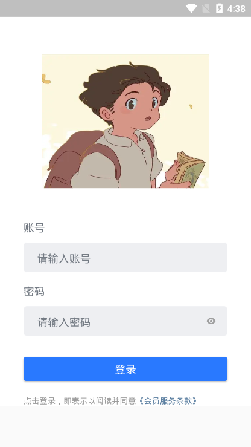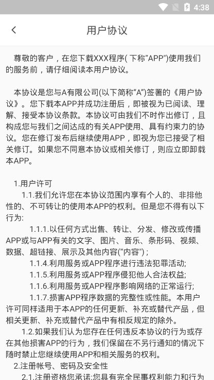
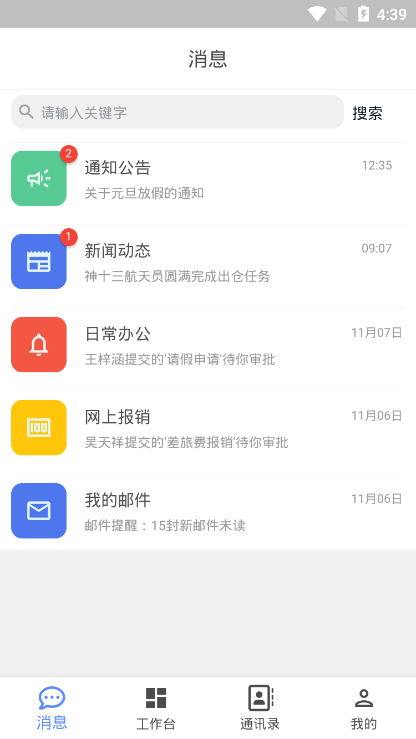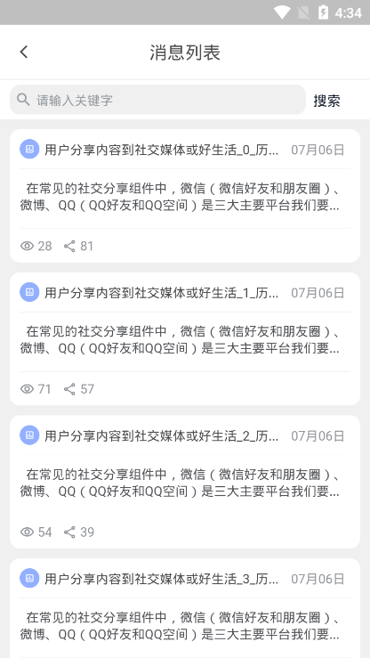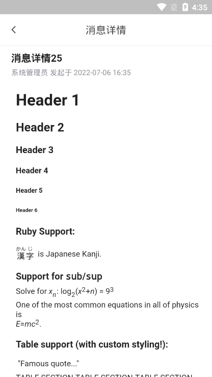
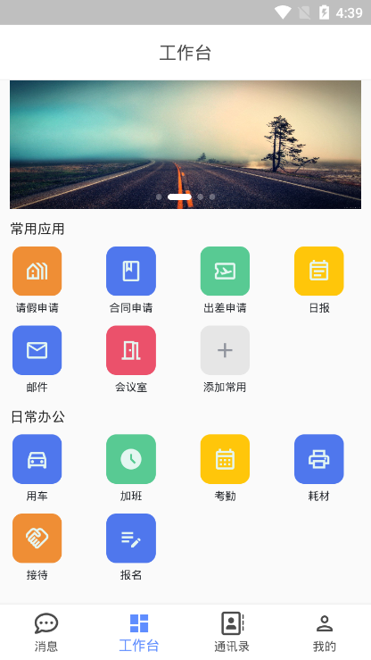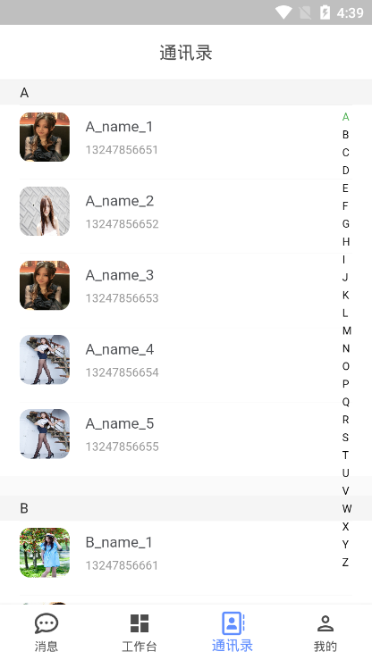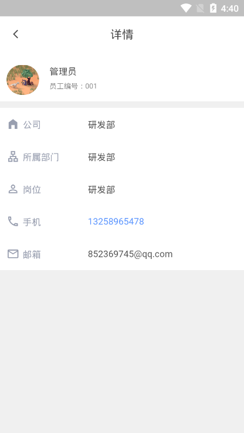
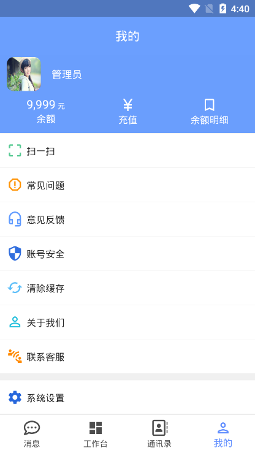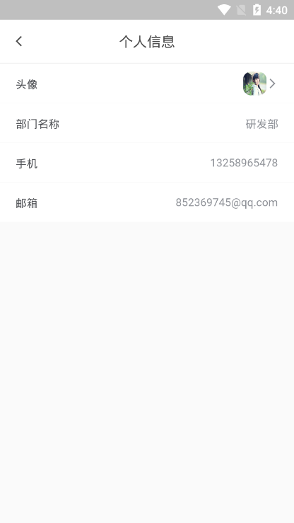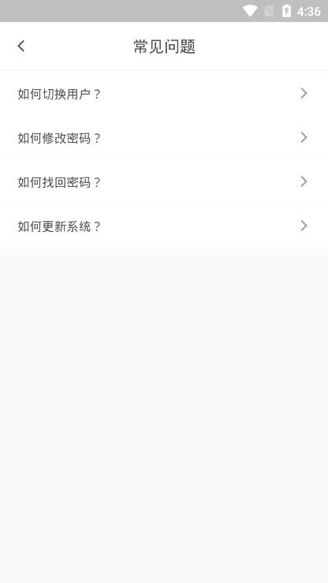
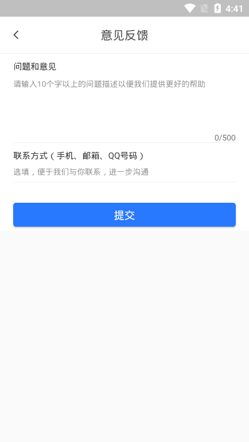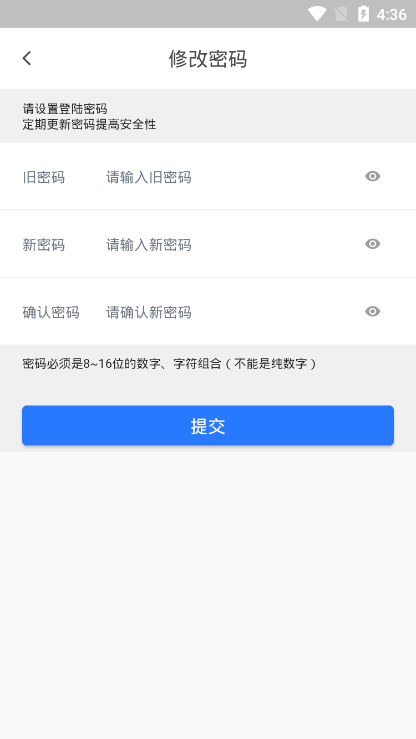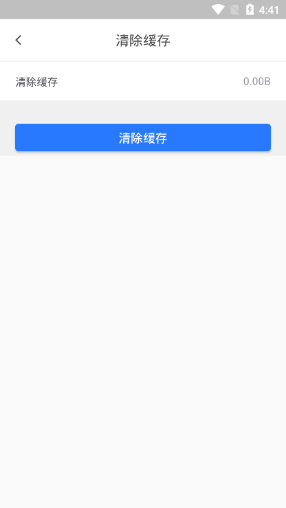
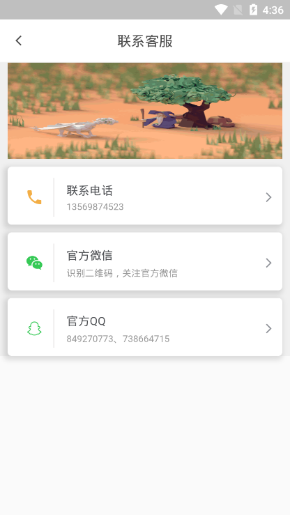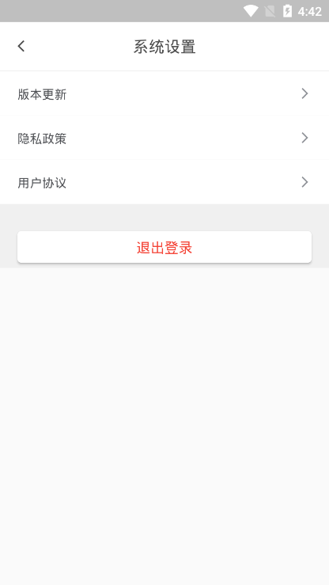
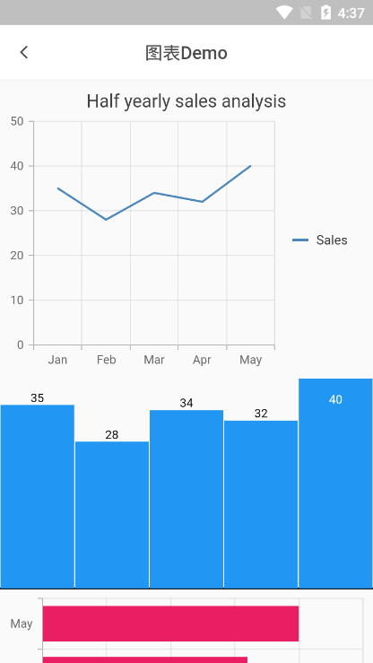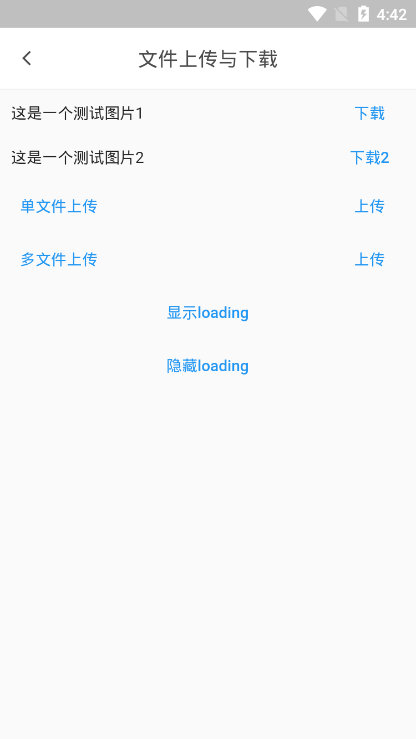

#### 疑问与打赏
如有疑问可以私信或者添加QQ：849270773联系我

